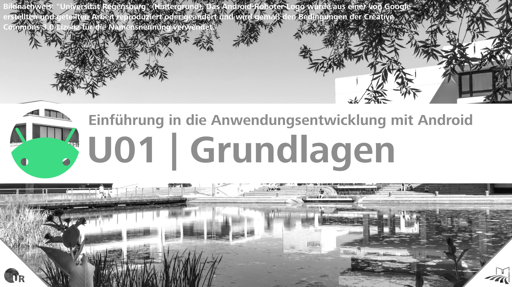
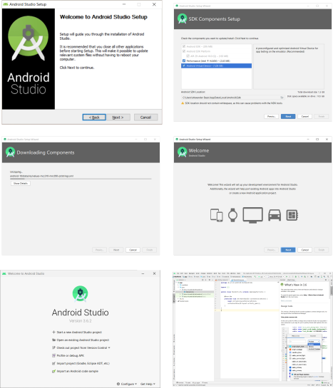

# U01 | Grundlagen und Einführung in die Entwicklungsumgebung Android Studio



Für die Entwicklung von Android-Anwendungen sind eine Reihe von Schritten und entsprechende Materialien notwendig: Sie müssen den Quellcode Ihrer Anwendung mit einer Programmiersprache (in diesem Kurs verwenden wir *Java*, native Android-Apps können aber auch auf Basis von *Kotlin* entwickelt werden) verfassen, dabei die von Google bereitgestellten Bibliotheken (*APIs*) nutzen, Bild- und andere Medieninhalte in Ihr *User Interface* integrieren und am Ende alle diese Inhalte in einem Format bereitstellen, das die Installation der Anwendung auf einem Smartphone erlaubt. Schließlich müssen wir die *App* auf dieses Smartphone übertragen und dort testen. Diese Schritte, die wir zum Teil wiederholt durchführen müssen, sind aufwendig und komplex. Wir bedienen uns daher einer *Integrierten Entwicklungsumgebung* (IDE), die uns wesentlich beim Programmieren, Kompilieren, Testen und Installieren von Android-Apps unterstützt. In diesem Kursen nutzten wir [Android Studio](https://developer.android.com/studio), das offiziellen Entwicklungswerkzeug, das uns und anderen EntwicklerInnen von der Firma Google, dem Entwickler der Android-Plattform, bereitgestellt wird. 

\pagebreak

**Im Rahmen dieser Übung gewinnen Sie einen ersten Überblick über die Entwicklungsumgebung *Android Studio* und machen sich mit den wesentlichen Bestandteilen und Funktionen vertraut. Sie lernen wie Sie die Entwicklungsumgebung und einen Emulator für das Testen Ihrer Anwendungen installieren und einrichten. Anhand eines ersten, eigenen *Hello World*-Projekts testen Sie, ob Sie Ihre Arbeitsumgebung korrekt eingerichtet haben.**

## Android Studio

*Android Studio* ist die offizielle Entwicklungsumgebung für das Implementieren, Designen, Kompilieren und Testen von Android-Anwendungen. Nach der Installation können Sie alle notwendigen Inhalte und Werkzeuge direkt über *Android Studio* installieren. Die Installation und die ersten Schritte mit der Software probieren wir später aus. Zuerst möchten wir Ihnen die wichtigsten Bestandteile der IDE vorstellen.

### Android Software Development Kit (SDK)


Beim Entwickeln von Android-Anwendungen müssen Sie das Rad nicht neu erfinden. Das **Android Software Development Kit** stellt die Klassen und *APIs* zur Verfügung, die Sie benötigen um z.B. Anwendungen und deren sichtbare Schaltfächern zu erstellen. Dabei handelt es sich um eine Klassen- bzw. Systembibliothek. Dieses Konzept kennen Sie so auch aus anderen Java-Bereichen: *Zur Ausgabe von Text haben Sie `System.out.println` verwendet, statt diese Funktionalität selber zu schreiben. Ein Anwendungsfenster erstellen wir auf Basis eines `JFrames`*. In diesem Fall werden Ihnen statt *Frames* oder Konsolenfenster die zentralen Bausteine für Android-Apps, z.B. Buttons, Listen oder Klassen für den Zugriff auf die Kamera oder die Internetverbindung des Smartphones bereitgestellt.

Es existieren verschiedene offizielle Versionen des Android-Systems. Da nicht alle Endgeräte automatisch die aktuellste Version unterstützen, ist es mitunter notwendig eine ältere Variante für die Entwicklung zu nutzen. In der Regel sind die Versionen untereinander abwärtskompatibel. Über den **Android SDK Manager**, einem weiteren Bestandteil des *SDKs*, können Sie die verschiedenen Plattformen oder Versionen auf Ihren Rechner herunterladen und damit in Ihrer Entwicklungsumgebung verfügbar machen. Die Plattformen enthalten die jeweiligen Versionen der Android-Systembibliotheken sowie weitere versionsspezifische Tools. Wenn Sie ein neues Android-Projekt anlegen, können Sie wählen welche der verfügbaren Applikationen Sie nutzen bzw. unterstützen wollen.

Neben dieser Klassenbibliothek beinhaltet das SDK eine Reihe von weiteren **Tools**, mit denen Sie sehr einfach Anwendungen debuggen und testen und dazu auf Emulatoren oder realen Android-Geräten installieren und ausführen können. Die einzelnen Tools können auch außerhalb von *Android Studio* genutzt werden. Der genaue Pfad auf ihrem Computer hängt von Ihrem Betriebssystem und der Art der SDK-Installation ab. Die Tools finden Sie in *Android Studio* unter dem Menüpunkt *Tools* und dann *Android* bzw. über die entsprechenden Symbole in der Leiste unter den Menüs.


### User Interface-Editor

Einige der zentralen Elemente eines Android-Projektes werden über XML-Dateien konfiguriert bzw. erstellt. Dazu gehören Layout-Modelle für das *User Interface*, wiederverwendbare Texte oder allgemeine Informationen zu Ihrer Anwendung (*Manifest*). Für Layout-Dateien stellt ihnen *Android Studio* einen zusätzlichen Editor zur Verfügung: Sie können diese Dateien entweder direkt durch Modifikation des XMLs verändern oder einen graphischen Editor nutzen. Zwischen diesen beiden Ansichten können Sie über die Schaltflächen rechts oben im Editor hin und her wechseln. Über den Eintrag `Show Layout Decorations` im Menü hinter dem *Augen*-Symbol (links oben) können Sie die restlichen Elemente des Android-Bildschirms zur Vorschau hinzufügen. 

 und XML-Code (Text)")

### Emulatoren

Das Android-SDK verfügt über einen [Emulator](https://de.wikipedia.org/wiki/Emulator). Dieses Tool erlaubt Ihnen, auf Ihrem Rechner ein Android-Gerät zu virtualisieren. Ein Emulator ist in diesem Fall ein Programm, das auf ihrem Rechner ausgeführt wird, aber in sich ein anders Betriebssystem und eine andere Hardware virtualisiert. In *Android Studio* werden diese Emulatoren *Virtual Devices* genannt. Mit dem **Android Virtual Device Manager** können Sie verschiedene dieser Emulatoren anlegen und dadurch unterschiedliche Geräte, z.B. Smartphones oder Tablets mit unterschiedlicher Displaygröße und Android-Version virtualisieren. Wenn Sie ein solches Gerät angelegt haben, können Sie ihre Anwendungen über *Android Studio* auf diesem Emulator installieren und ausführen. Das *Virtual Device* stellt ihre App dann ähnlich wie auf einem tatsächlichen Android-Gerät dar. Sie können die Anwendung mit der Maus steuern. Ein einfacher Klick simuliert dabei einen Kontakt auf dem Touchscreen. Das Ziehen des Fingers (*Drag*) kann über die gedrückte Taste und eine Mausbewegung simuliert werden.

**Hinweise**: In einigen Fällen, z.B. bei der Verwendung neuerer AMD-Prozessoren, kann es [zu Problemen](https://stackoverflow.com/questions/44249419/i-have-got-an-amd-ryzen-cpu-and-android-emulator-doesnt-work) beim Einrichten und Verwenden des Emulators kommen. Eine knappe Beschreibung zum eigenständigen Lösen dieser Probleme finden Sie [hier](https://www.reddit.com/r/androiddev/comments/dn0be4/android_emulator_hypervisor_driver_for_amd/). Bitte wenden Sie sich bei Problemen dieser Art per E-Mail oder Forum an uns. Wir helfen gerne und besprechen das technische Setup auch in der ersten Übungssitzung.

## Android auf dem eigenen Rechner

Die passende Version von *Android Studio* für Ihren Rechner finden Sie auf [dieser Website](https://developer.android.com/studio#downloads). Laden Sie die entsprechende Datei, für Windows wäre es in den meisten Fällen die 64-bit Version des *Installers* (`android-studio-ide-192.6308749-windows.exe`), herunter und installieren Sie das Programm auf Ihrem Rechner. Vor dem Herunterladen müssen Sie den Lizenzbedingungen zustimmen. 

Der *Installer* leitet Sie durch den Installationsprozess und startet im Anschluss automatisch *Android Studio*.

Beim ersten Start von *Android Studio* müssen einige Einstellungen vorgenommen und zusätzliche Inhalte heruntergeladen werden. Bestätigen Sie die Dialoge, bis Sie zum *Android Studio Setup Wizard* gelangen.

Wählen Sie hier die Standardeinstellungen aus oder passen Sie das Erscheinungsbild der IDE an Ihre Vorlieben an.

Interessant wird es bei den *SDK Components*. Wählen Sie hier unbedingt auch das *Android Virtual Device* aus und passen Sie ggf. den Installationspfad an (Mit der Zeit kann der SDK-Ordner recht groß werden, wenn Sie z.B. eine sehr kleine Windows-Partition eingerichtet haben, empfiehlt es sich, die SDK-Inhalte an einem anderen Ort zu installieren.).

Das jetzt folgende Herunterladen der Inhalte kann je nach Internetverbindung etwas dauern.



## Die erste App: Ein neues Projekt anlegen

Klicken sie auf dem Willkommen-Screen von *Android Studio* auf `Start a new Android Studio project` bzw. auf in der Menüleiste auf `File` und dann `New Project...`, falls derzeit gerade ein Projekt geöffnet ist. 

Im ersten Schritt wählen Sie die Art Ihrer Anwendung aus. Android-Apps können auf einer Vielzahl von Geräten verwendet werden, in diesem Kurs beschäftigen wir uns hauptsächlich mit Anwendungen für *Phones and Tablets*. Auch die Vorauswahl *Empty Activity* können Sie vorerst so belassen. 

Im folgenden Schritt werden grundlegende Daten für die App abgefragt:

- **Application Name**: Dieser Name erscheint auf dem Gerät des Benutzers im Launcher und sollte ihre App beschreiben.
- **Company Domain**: Die Domain der Entwicklerfirma in umgekehrter Reihenfolge. Aus `google.com` wird etwa `com.google`
- **Package Name**: Dieser Bezeichner soll Ihre App eindeutig identifizieren und ist von zentraler Bedeutung für ihre App selbst, aber auch für das mögliche Zusammenspiel mit anderen Applikationen. Er wird standardmäßig automatisch aus dem Namen der Anwendung und der Firmendomain erstellt, aber per Klick auf *edit* ist eine nachträgliche Veränderung möglich. Der *Package Name* wird  in Form einer vereinfachten URI angegeben (Beispielsweise: `de.ur.mi.android.helloandroid`). Verbreitet ist hier das Schema der *Reversed URL*, also der umgedrehten Webadresse mit einer abschließenden Ergänzung für die jeweilige Applikation.
- **Save location**: Hier geben Sie den Ort auf Ihrer Festplatte an, an dem die Projektdateien für diese Anwendung gespeichert werden sollen. Wenn Sie uns, z.B. bei technischen Fragen, den Code zukommen lassen wollen, können Sie diesen Order, gepackt als ZIP-Datei, an uns senden. Wir können das Projekt dann an unseren Rechnern öffnen und ausprobieren.
- **Language**: Android-Anwendungen können mit den Programmiersprachen Java oder Kotlin erstellt werden. Bitte wählen Sie hier `Java` aus.
- **Minimum SDK**:  Wählen Sie in der Liste *API 23* aus. Damit geben Sie an, dass Ihre Anwendung auf allen Geräten funktionieren wird, die mindestens diese Android-Version (*Android 6*) verwenden.

Der Klick auf den *Button* `Finish` schließt die Einrichtung ab und erstellt das Projekt. Nach kurzer Ladezeit sehen Sie jetzt das erste Mal die vollständige Entwicklungsumgebung und können mit der Arbeit an Ihrer ersten Anwendung beginnen.

In der Dateiliste auf der linken Seite finden sie unter `app`,  `java`, `<paketname>`, `MainActivity.java` ihre erste *Activity*. Eine *Activity* bündelt die Logik einer bestimmten, sichtbaren Komponente ihrer App. Das Aussehen dieser Komponente wird über eine Layout-Datei definiert. Diese Layouts finden sich als XML-Datei unter `res/layout` und werden innerhalb des *Activity*-Codes referenziert.

### Ausführen des angelegten Projekts

Sie können die erstellte Anwendung  direkt ausführen, indem sie Ihr Projekt über den grünen *Run*-Button in der Menüleiste (etwa in der Mitte) starten. Die Anwendung wird dann entweder auf einem angeschlossenen Android-Gerät oder einem *Virtual Device* ausgeführt. Sollten weder ein Gerät angeschlossen noch ein Emulator verfügbar sein wird *Android Studio* sie auffordern, ein neues *Virtual Device* anzulegen.

Ihre App wird nun auf dem Emulator oder dem angeschlossenen Gerät installiert und ausgeführt. Wenn Sie den Emulator nutzen, kann dessen Boot-Vorgang einige Minuten in Anspruch nehmen. Sie sollten anschließend ihre App und dort den Text *Hello world!* sehen.

### Erste Modifikationen

Schauen Sie sich nun die Datei `activity_main.xml` an. Hier finden Sie die Definition für das Textfeld, dass den *Hello world!*-Text beinhaltet. Der Text selber wird über das XML-Attribut `text` gesetzt. In diesem Beispiel wird der anzuzeigende Text nicht direkt angegeben, sondern durch einen Verweis dargestellt. Ressourcen, auch Text, können in gesonderten Dateien zentral gespeichert und dann von verschiedenen Stellen referenziert werden. Der hier verwendete Text- Baustein `hello_world` wird in der Datei `res/values/strings.xml` definiert. Öffnen Sie diese Datei, versuchen Sie den definierten Text zu ändern und führen Sie ihre Applikation erneut aus.

**Inhalt von `activity_main.xml`**

``` xml
<RelativeLayout xmlns:android="http://schemas.android.com/apk/res/android"
                android:layout_width="match_parent"
                android:layout_height="match_parent"
                android:paddingBottom="@dimen/activity_vertical_margin"
                android:paddingLeft="@dimen/activity_horizontal_margin"
                android:paddingRight="@dimen/activity_horizontal_margin"
                android:paddingTop="@dimen/activity_vertical_margin">

   <TextView
      android:layout_width="wrap_content"
      android:layout_height="wrap_content"
      android:text="@string/hello_world"/>

</RelativeLayout>
```

